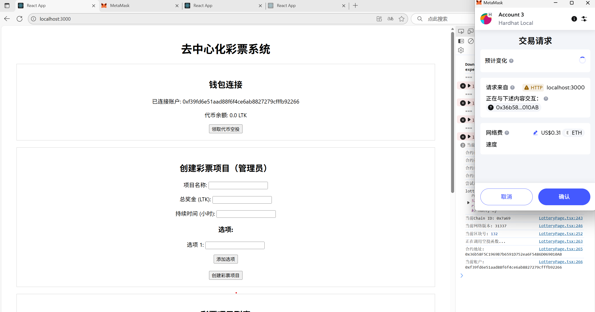
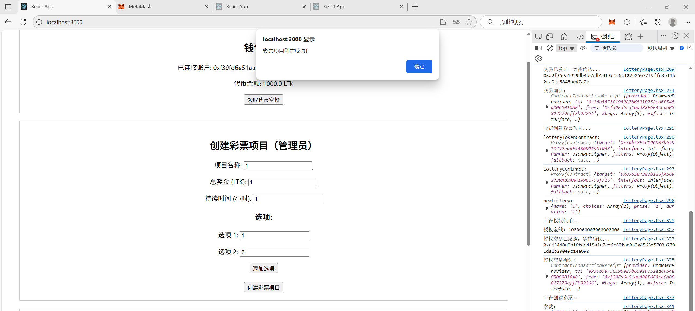
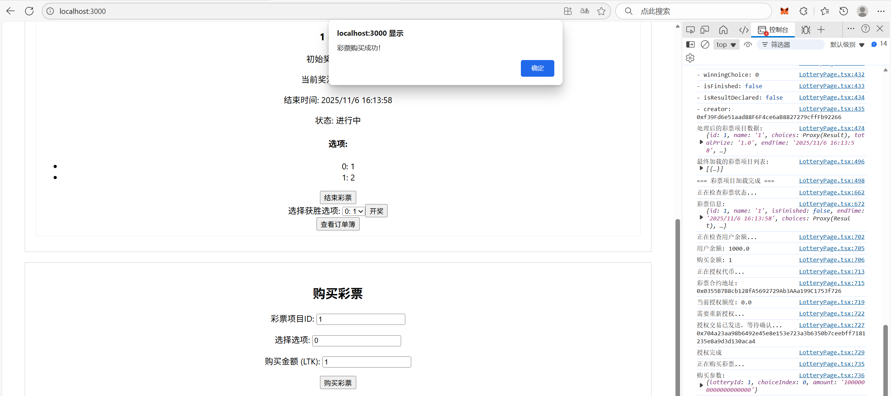
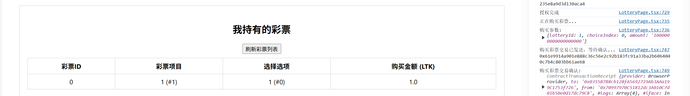
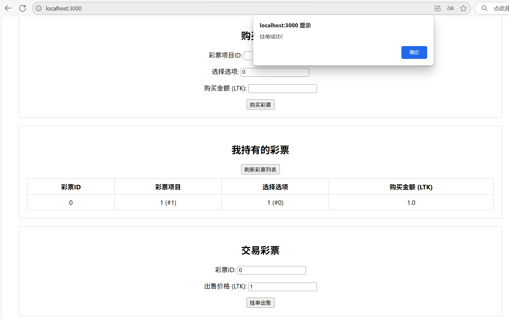
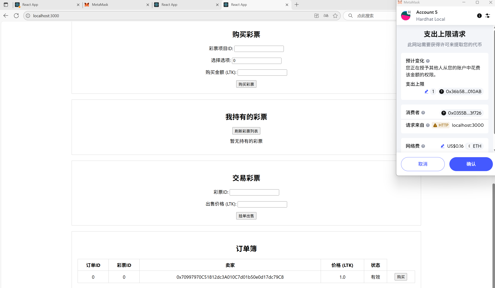
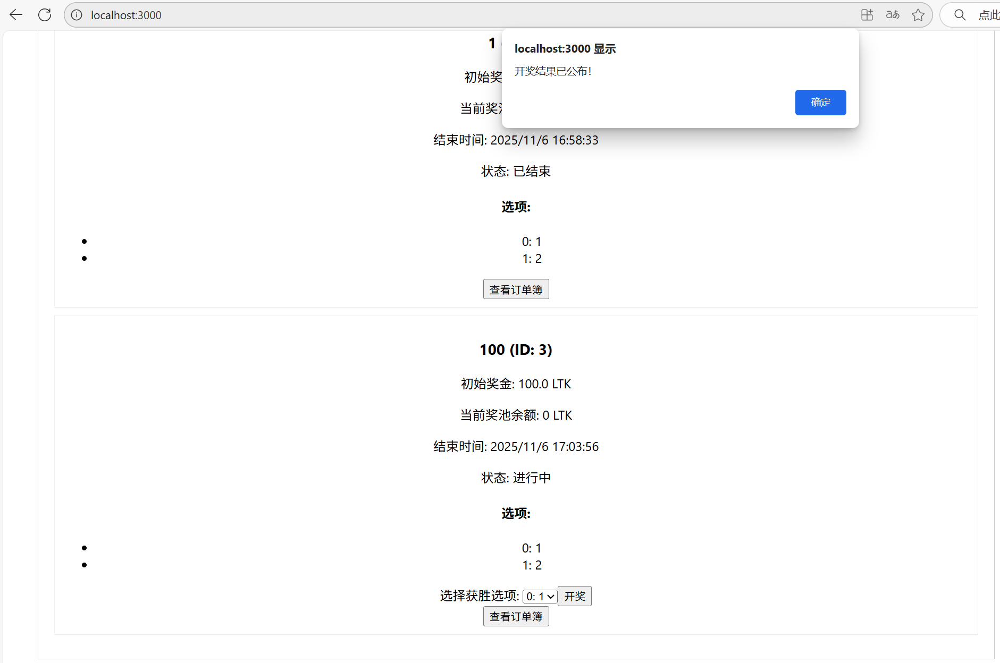

# ZJU-blockchain-course-2025-ymy

⬆ 可以️修改成你自己的项目名。

> 第二次作业要求（以下内容提交时可以删除）：
> 
> 进阶的去中心化彩票系统，参与方包括：竞猜玩家、公证人
>
> **背景**：传统的体育彩票系统（例如我国的体育彩票）一般没有彩票交易功能：例如，对于“NBA本赛季MVP为某球员/F1的赛季总冠军为某车队”这类持续时间长的事件的下注一般在赛季开始前就会买定离手，这使得一旦出现突发或不确定事件（如球员A赛季报销/球队B买入强力球星/C车队车手受伤等），很多玩家的选择便会立即失去意义，导致彩票游戏的可玩性下降。因此，一个有趣的探索方向是让彩票系统拥有合规、方便的交易功能。
>
> 建立一个进阶的去中心化彩票系统（可以是体育彩票，或其它任何比赛节目的竞猜，例如《中国好声音》《我是歌手》年度总冠军等，可以参考 [Polymarket](https://polymarket.com/) ），在网站中：
> - 公证人（你自己）可以创立许多竞猜项目：例如某场比赛的输赢、年度总冠军的得主等，每个项目应当有2个或多个可能的选项，一定的彩票总金额（由公证人提供），以及规定好的结果公布时间。
> - 玩家首先领取到测试所需以太币。在网站中，对于一个竞猜项目和多个可能的选项：
>   1. 每个竞彩玩家都可以选择其中的某个选项并购买一定金额（自己定义）的彩票，购买后该玩家会获得一张对应的彩票凭证（一个 ERC721 合约中的 Token）
>   2. 在竞彩结果公布之前，任何玩家之间可以买卖他们的彩票，以应对项目进行期间的任何突发状况。具体的买卖机制如下：一个玩家可以以指定的金额挂单出售（ERC721 Delegate）自己的彩票，其它玩家如果觉得该彩票有利可图就可以买入他的彩票。双方完成一次 ERC721 Token 交易。
>   3. 公证人可以在时间截止时（简单起见，你可以随时终止项目）输入竞猜的结果并进行结算。所有胜利的玩家可以平分奖池中的金额。
> - Bonus（最多5分，若想要完成，可以直接将功能整合进上述要求中）：
>   1. （2分）发行一个 ERC20 合约，允许用户领取 ERC20 积分，并使用ERC20积分完成上述流程。
>   2. （3分）对交易彩票的过程实现一个简单的链上订单簿：卖方用户可以以不同价格出售一种彩票，网页上显示当前订单簿的信息（多少价格有多少该彩票正在出售）。其他用户可以根据最优价格购买彩票。
> - 可以对上述需求进行合理更改和说明。请大家专注于功能实现，网站UI美观程度不纳入评分标准，能让用户能够舒适操作即可。

**以下内容为作业仓库的README.md中需要描述的内容。请根据自己的需要进行修改并提交。**

作业提交方式为：**提交视频文件**和**仓库的链接**到指定邮箱。

## 如何运行

补充如何完整运行你的应用。

1. 确保你已经安装了以下软件：

   - Node.js (推荐版本 16.x 或 18.x)
   - npm 或 yarn 包管理器

2. 首先需要启动一个本地的以太坊测试网络
    ```bash
    # 进入合约目录
    cd ZJU-blockchain-course-2025
    cd contracts

    # 安装合约依赖
    npm install

    # 启动本地测试网络 (Hardhat Network)
    npx hardhat node
    ```
    这将启动一个本地的以太坊网络，通常在 http://127.0.0.1:8545 上运行。
3. 在另一个终端窗口中，部署智能合约到本地网络
    ```bash
    # 仍在 contracts 目录中
    npx hardhat compile

    # 部署合约
    npx hardhat run scripts/deploy.ts --network localhost
    ```
4. 部署完成后，记录下输出的合约地址，需要更新到前端配置中。
   打开 frontend/src/utils/contracts.ts 文件，更新 CONTRACT_ADDRESSES 对象中的地址：
    ```ts
    const CONTRACT_ADDRESSES = {
    lotteryToken: "这里填入LotteryToken合约地址",
    lotteryTicket: "这里填入LotteryTicket合约地址",
    lottery: "这里填入Lottery合约地址"
    };
    ```

5. 启动前端应用
   ```bash
   # 进入前端目录
    cd ../frontend

    # 安装前端依赖
    npm install

    # 启动前端应用
    npm run start
    ```


6. 配置MetaMask钱包
    - 打开浏览器中的MetaMask插件
    - 添加本地网络：
    网络名称：Hardhat Local
    RPC URL：http://127.0.0.1:8545
    Chain ID：31337
    Currency Symbol：ETH
    (注意将该网络拖动到最高连接优先级)
    - 导入本地网络中的账户私钥（从Hardhat Network启动时输出的账户中选择一个）
7. 使用应用
    - 打开浏览器访问 http://localhost:3000
    - 连接MetaMask钱包
    - 领取代币空投
    - 作为公证人创建彩票项目（注意，合约部署时Hardhat Network报文中"From:"后的地址就是公证人地址，其他地址对应的账户无法创建彩票项目）
    - 作为玩家购买彩票
    - 进行彩票交易，卖家通过挂单出售界面售卖持有的彩票，卖家通过点击彩票项目列表下订单簿按钮查看在售彩票并购买
    - 公布开奖结果（只有公证人可以进行）
    - 所有涉及代币或彩票的交易都需要在点击按钮后等待一段时间至metamask确认界面弹出，部分操作需要等待两次，等待时间较长，请勿在等待过程中进行其他操作！

## 功能实现分析

简单描述：项目完成了要求的哪些功能？每个功能具体是如何实现的？

建议分点列出。
1、ERC20代币系统
功能：实现了一个名为LotteryToken (LTK)的ERC20代币，用于彩票系统的交易媒介
实现方式：
- 使用OpenZeppelin的ERC20和Ownable合约构建
- 提供空投功能，每个用户可以领取1000 LTK初始资金
- 通过airdrop()函数实现，防止重复领取
2、ERC721彩票NFT系统
功能：将彩票实现为NFT，使每张彩票具有唯一性和可交易性
实现方式：
- 基于OpenZeppelin的ERC721和ERC721Enumerable合约
- 每张彩票包含项目ID、选择索引和购买金额等信息
- 通过mint()函数由彩票合约铸造并分配给购买者
3、彩票项目创建
功能：公证人可以创建彩票项目，设定选项和奖金池
实现方式：
- 通过createLottery()函数创建项目，需要指定名称、选项、奖金总额和持续时间
- 公证人需要预先批准并转入奖金到彩票合约
- 只有合约所有者（公证人）可以创建项目
4、彩票购买
功能：玩家可以选择彩票项目中的选项并购买相应金额的彩票
实现方式：
- 通过buyTicket()函数实现，需要指定项目ID、选项索引和购买金额
- 购买时自动将资金分为两部分：10%给项目创建者，90%进入奖池
- 成功购买后铸造对应的彩票NFT
5、彩票交易系统
功能：玩家可以在项目结束前交易持有的彩票
实现方式：
- 通过placeOrder()函数挂单出售彩票，指定价格
- 通过buyOrder()函数购买他人挂单的彩票
- 实现了链上订单簿，记录所有挂单信息
6、开奖与奖金分配
功能：公证人可以结束项目并公布开奖结果，系统自动分配奖金
实现方式：
- 通过declareResult()函数公布开奖结果，指定获胜选项
- 通过_distributePrizes()内部函数按比例分配奖金给获胜者
- 获胜者可以通过finishLottery()函数结束项目
7、前端交互界面
功能：提供完整的Web界面供用户与合约交互
实现方式：
- 使用React构建用户界面
- 集成MetaMask钱包连接
- 实现了钱包连接、代币空投领取、项目创建、彩票购买、交易、开奖等所有功能的前端界面
- 实时显示用户持有的彩票、订单簿信息和项目状态
## 项目运行截图

放一些项目运行截图。

项目运行成功的关键页面和流程截图。主要包括操作流程以及和区块链交互的截图。
1、连接MetaMask钱包，领取空投：

2、创建彩票项目：

3、购买彩票：


4、交易彩票：


5、开奖：



## 参考内容

- 课程的参考Demo见：[DEMOs](https://github.com/LBruyne/blockchain-course-demos)。

- 快速实现 ERC721 和 ERC20：[模版](https://wizard.openzeppelin.com/#erc20)。记得安装相关依赖 ``"@openzeppelin/contracts": "^5.0.0"``。

- 如何实现ETH和ERC20的兑换？ [参考讲解](https://www.wtf.academy/en/docs/solidity-103/DEX/)

如果有其它参考的内容，也请在这里陈列。
